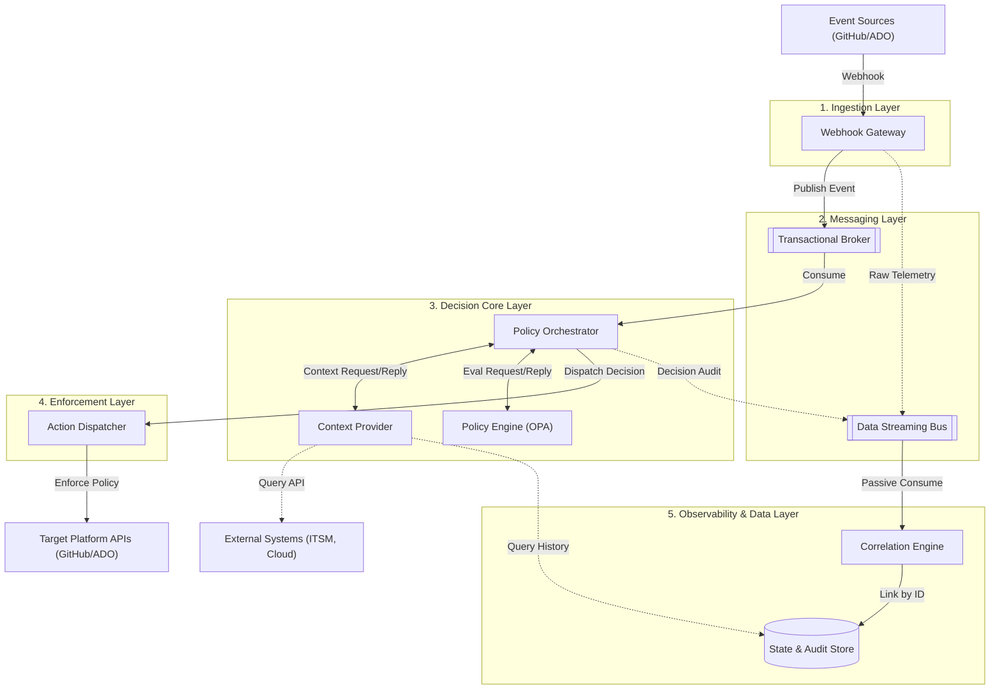
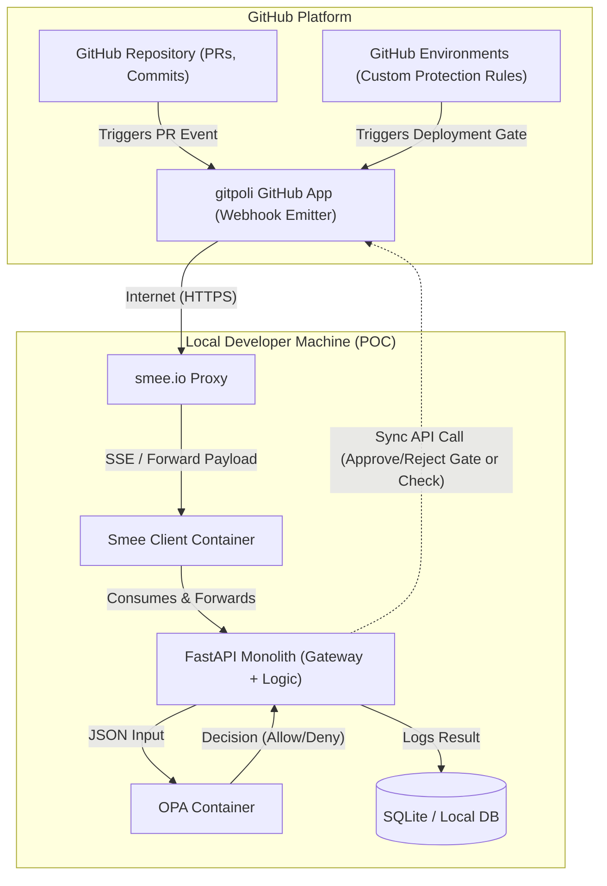
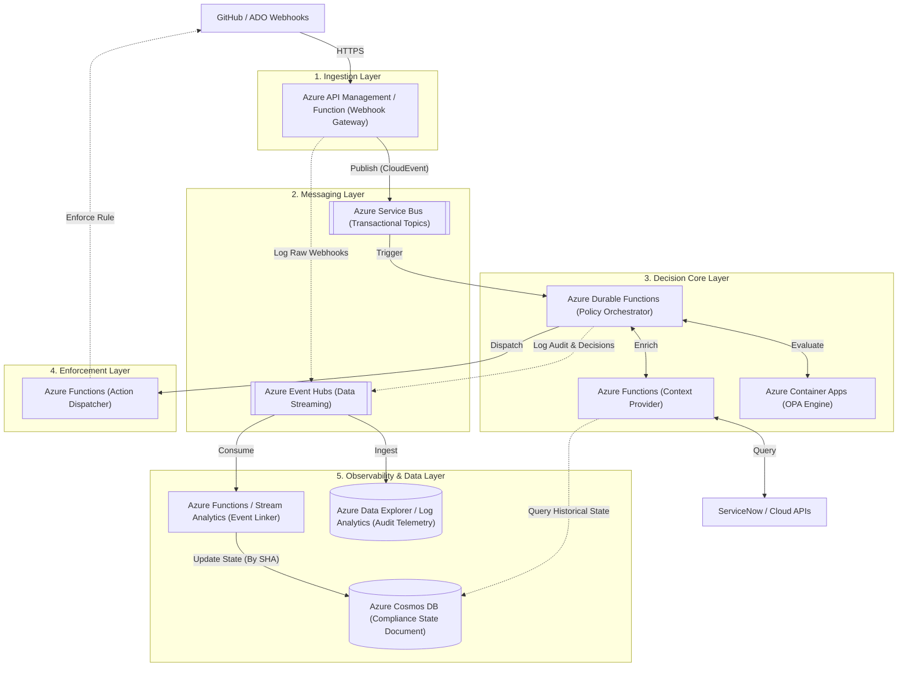
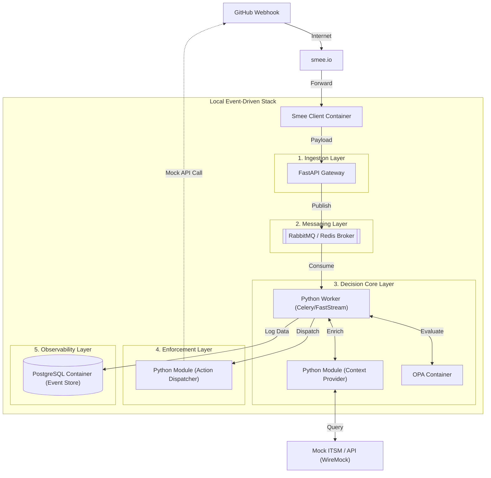

# ADR: Event-Driven Policy as Code Architecture for gitpoli

## Status
Proposed

## Context
The `gitpoli` platform implements the Policy as Code principle for managing deployment policies, pull request validations, and release gates. The primary goal is to decouple policy logic from application code, enabling versioning, auditability, and automated validation.

Currently, the codebase and proof of concept (POC) reflect a synchronous, monolithic approach. Events are received, passed directly to the Open Policy Agent (OPA), and logged in a single linear flow. While functional for a simple GitHub demo, this current state does not scale for advanced, enterprise-grade use cases:
* **Multi-Platform Support:** Receiving events from diverse platforms (GitHub, Azure DevOps, GitLab, etc.) requires a standardized ingestion layer.
* **Complex Policies & Release Gates:** Evaluating rules that depend on external state, such as verifying ITSM ticket approvals (e.g., Jira, ServiceNow) or checking infrastructure configuration before deploying to production.
* **Asynchronous Execution:** Heavy evaluations and external API calls must not block upstream webhooks or cause timeouts on the platform side.
* **Event Correlation:** Auditing and compliance require linking multiple distinct events over time (e.g., tying a specific PR approval to a deployment artifact and its compliance status).

## Decision
We will transition from the current synchronous POC to an **event-driven, highly decoupled architecture based on Serverless/PaaS services**. To maintain strict separation of concerns and ensure the system is highly modular, the architectural components are grouped into five logical layers. This design separates the transactional plane (rule execution) from the audit plane (telemetry streaming and correlation).

---

## 1. Architectural Layers & Components (Target State / To-Be)

### 1.1. Ingestion Layer
Responsible solely for securely receiving external signals and acknowledging them quickly.
* **Webhook Gateway:** The single public entry point for all external platforms emitting events. Webhook emitters (like GitHub or ADO) require fast responses. It receives the webhook, validates cryptographic signatures, normalizes the disparate payload into an internal standard (like *CloudEvents*), immediately publishes it to the Event Bus, and returns a `200 OK` HTTP code to release the connection.

### 1.2. Messaging Layer
The asynchronous transport backbone that guarantees delivery, separates operational traffic from telemetry, and buffers load spikes.
* **Transactional Message Broker (Control Plane):** An asynchronous messaging queue oriented towards transactions (e.g., Azure Service Bus, RabbitMQ). It ensures no evaluation event is lost, allowing for automatic retries or Dead Letter Queues (DLQ) if the engine fails.
* **Data Streaming Bus (Audit & Telemetry Plane):** A massive data stream ingestion engine (e.g., Azure Event Hubs). It passively ingests copies of original events and final decisions to dump them at high speed into the analytical storage system without slowing down the transactional flow.

### 1.3. Decision Core Layer
The brain of the platform. It handles workflow coordination, gathers state, and executes pure logic.
* **Policy Orchestrator:** The coordinating "brain" of the workflow. It consumes normalized events from the Transactional Broker, identifies which policy applies, requests necessary extra data from the Context Provider, sends the full package to OPA, and delegates the enforcement.
* **Context Provider (Context Enricher):** A service dedicated exclusively to fetching external data. It queries external APIs (ITSM, Cloud, Databases) and returns a consolidated ("enriched") JSON containing all the necessary state of the world so the policy can be evaluated blindly.
* **Policy Engine (OPA):** The purely logical and mathematical execution engine based on Open Policy Agent and Rego. It isolates the compliance policy source code from the platform's integration logic, executing rules and returning a strict verdict (`allow`, `deny`, or `violations`).

### 1.4. Enforcement Layer
The outbound integration tier that translates internal decisions into specific actions on external platforms.
* **Action Dispatcher:** The outbound enforcement component. It isolates OPA and the Orchestrator from the specifics of the target platform APIs, translating the final decision into the specific API call required (e.g., making a POST request to the GitHub API to fail a Check Run).

### 1.5. Observability & Data Layer
The historical memory of the system, responsible for compliance tracking, event lineage, and security auditing.
* **Event Store & Correlation Engine:** An analytical database ecosystem (e.g., Cosmos DB + Log Analytics). It passively listens to the Data Streaming Bus, using unified identifiers (like the *Commit SHA*) to build a single document representing the entire lifecycle of a code change for security auditing and resolving rules that span across time.

---

## 2. Architecture Diagrams

### 2.1. Conceptual Target Architecture (To-Be)
This diagram shows the technology-agnostic logical flow, highlighting the separation of concerns through the five architectural layers.

### 2.2. Current Architecture (As-Is / POC)
The current implementation synchronously couples ingestion, evaluation, and enforcement into a single monolith. This diagram illustrates the detailed integration with GitHub using a GitHub App and Custom Protection Rules routed through Smee.

### 2.3. Enterprise Implementation in Azure (To-Be Serverless)
Mapping the conceptual architecture layers to native Microsoft Azure Serverless and PaaS services, optimizing for cost and scalability.

### 2.4. Local Development & Integration Testing (Docker Compose)
To maintain an agile local development cycle, the layered cloud architecture is emulated using lightweight containers and mock implementations.

---

## Consequences

* **Pros:**
  * **Technology Agnostic:** Core logic is insulated from specific tools; components can be swapped with minimal impact due to strict layer separation.
  * **Highly Scalable:** Asynchronous processing prevents bottlenecks during high loads or slow external API responses.
  * **Extensible Context:** Easily handles complex policies like Release Gates by plugging new data sources into the Context Provider within the Decision Core.
  * **Robust Auditing:** The Observability Layer provides a single source of truth for compliance reporting and historical event lineage without impacting transactional performance.
  * **Cost-Effective (Azure):** Utilizing a fully Serverless stack scales to zero and eliminates the overhead of managing underlying infrastructure.
* **Cons:**
  * **Increased Architecture Complexity:** Requires deploying and maintaining multiple components across layers compared to a simple synchronous API.
  * **Tracing Difficulty:** Troubleshooting requires robust distributed tracing (e.g., correlation IDs) as requests flow asynchronously through queues.
  * **Eventual Consistency:** External platform updates (like GitHub checks) are not strictly synchronous with the initial webhook trigger.
