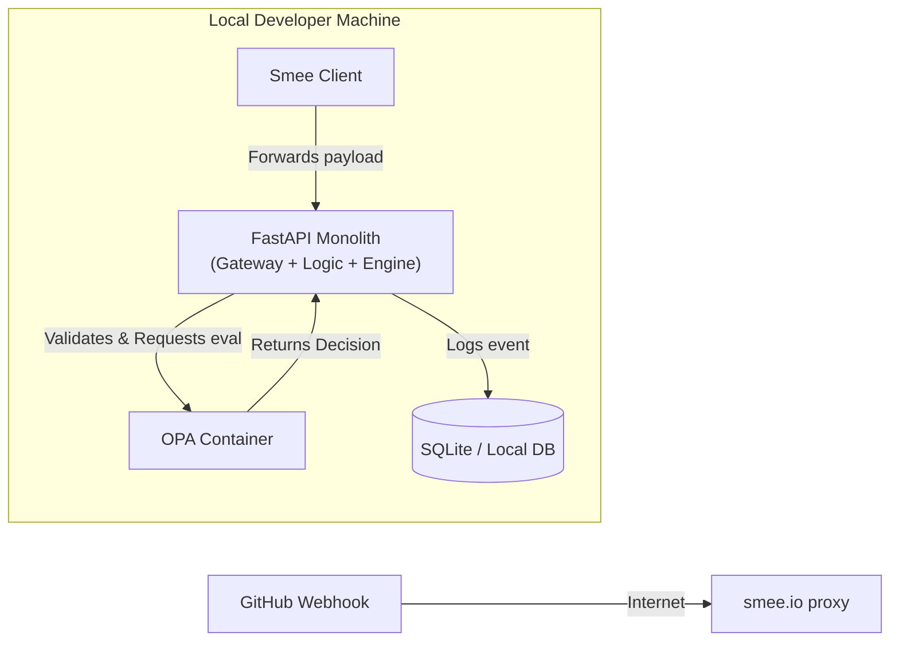
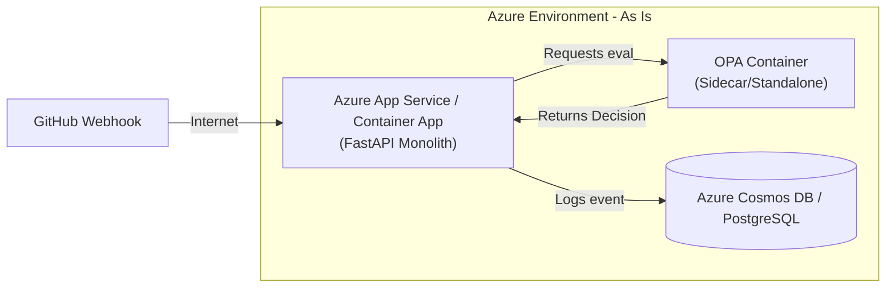
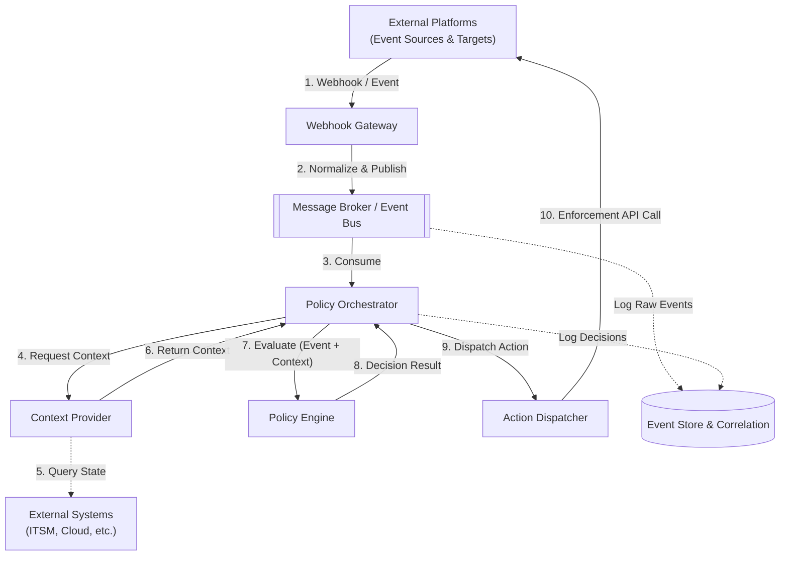
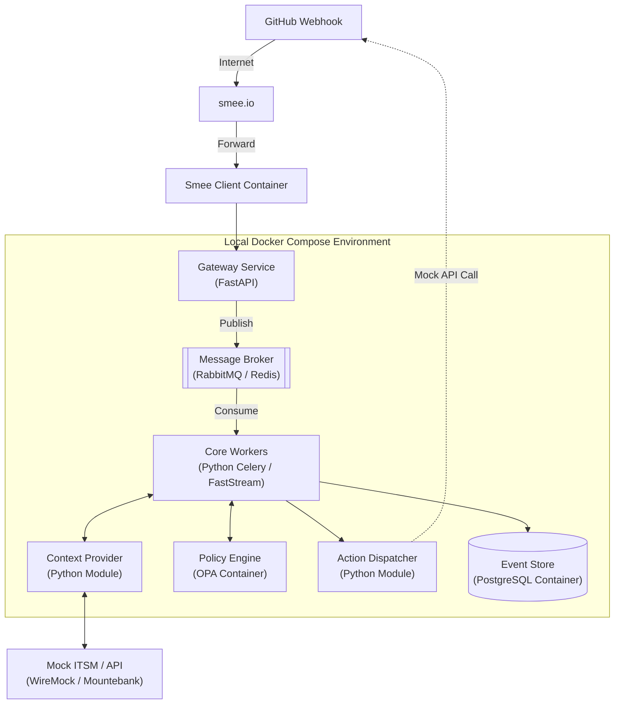
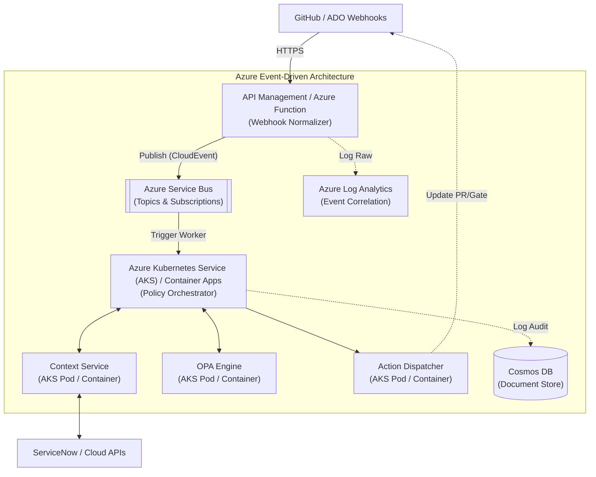

# ADR: Event-Driven Policy as Code Architecture for gitpoli

## Status
Proposed

## Context
The `gitpoli` platform implements the Policy as Code principle for managing deployment policies, pull request validations, and release gates. The primary goal is to decouple policy logic from application code, enabling versioning, auditability, and automated validation.

Currently, the codebase and proof of concept (POC) reflect a synchronous, monolithic approach. Events are received, passed directly to the Open Policy Agent (OPA), and logged in a single linear flow. While functional for simple GitHub pull requests, this current state does not scale for advanced, enterprise-grade use cases:
* **Multi-Platform Support:** Receiving events from diverse platforms (GitHub, Azure DevOps, GitLab, etc.) requires a standardized ingestion layer.
* **Complex Policies & Release Gates:** Evaluating rules that depend on external state, such as verifying ITSM ticket approvals (e.g., Jira, ServiceNow) or checking infrastructure status before deploying to production.
* **Asynchronous Execution:** Heavy evaluations and external API calls must not block upstream webhooks or cause timeouts on the platform side.
* **Event Correlation:** Auditing and compliance require linking multiple distinct events over time (e.g., tying a specific PR approval to a deployment artifact and its compliance status).

## Decision
We will transition from the current synchronous POC to an **event-driven, highly decoupled architecture** centered around an asynchronous message broker, a policy orchestrator, and dedicated context enrichment.

---

## 1. Current State Architecture (As-Is / POC)

The current implementation in the repository relies on a synchronous API that tightly couples ingestion, evaluation, and enforcement.

### 1.1 Local Integration Testing (POC)
Uses `smee.io` to proxy webhooks to a local developer machine where a single application handles all logic.

### 1.2 Azure Cloud Deployment (POC)
If deployed as-is, the architecture remains synchronous, replacing local containers with managed App Services.

---

## 2. Target Conceptual Architecture (To-Be)

This is the technology-agnostic, high-level component model that dictates the logical flow of the new platform. 

### Architectural Components

1. **Webhook Gateway:** The single, non-blocking entry point that validates incoming webhooks, normalizes diverse payloads into a standardized internal event format (e.g., CloudEvents), and immediately pushes them to the Event Bus.
2. **Message Broker / Event Bus:** The asynchronous messaging backbone that decouples fast ingestion from heavy processing, ensuring system resilience.
3. **Policy Orchestrator:** Consumes normalized events from the bus and coordinates the interaction between the Context Provider, Policy Engine, and Action Dispatcher.
4. **Context Provider:** Responsible for data enrichment. It queries external APIs (ITSM, cloud) or internal databases to build a comprehensive context payload for policies that require external state.
5. **Policy Engine:** A stateless, pure logic execution engine (OPA/Rego) that evaluates the normalized event and enriched context against declarative policy rules.
6. **Action Dispatcher:** Translates the definitive decision from the Policy Engine into platform-specific API calls (e.g., blocking an ADO deployment gate or failing a GitHub PR check).
7. **Event Store & Correlation:** Centralized storage for raw events, enriched contexts, and decisions, providing an immutable audit trail and enabling the correlation of events over time.

---

## 3. Target Implementation Architecture (To-Be)

Translating the conceptual model into specific technology stacks for local development and enterprise cloud deployment.

### 3.1 Local / Integration Testing Environment (Docker Compose)
A lightweight containerized setup simulating the distributed cloud architecture for local development.

### 3.2 Azure Production Environment (Enterprise Stack)
A robust, scalable cloud architecture utilizing managed Azure services and container orchestration.

---

## Consequences

* **Pros:**
  * **Technology Agnostic:** Core logic is insulated from specific tools; components can be swapped with minimal impact.
  * **Highly Scalable:** Asynchronous processing prevents bottlenecks during high loads or slow external API responses.
  * **Extensible Context:** Easily handles complex policies like Release Gates by plugging new data sources into the Context Provider.
  * **Robust Auditing:** The Event Store provides a single source of truth for compliance reporting and historical event correlation.
* **Cons:**
  * **Increased Architecture Complexity:** Requires deploying and maintaining multiple components (Broker, Store, Orchestrator) compared to a simple synchronous API.
  * **Tracing Difficulty:** Troubleshooting requires robust distributed tracing (e.g., correlation IDs) as requests flow asynchronously through queues.
  * **Eventual Consistency:** External platform updates (like GitHub checks) are not strictly synchronous with the initial webhook trigger.
