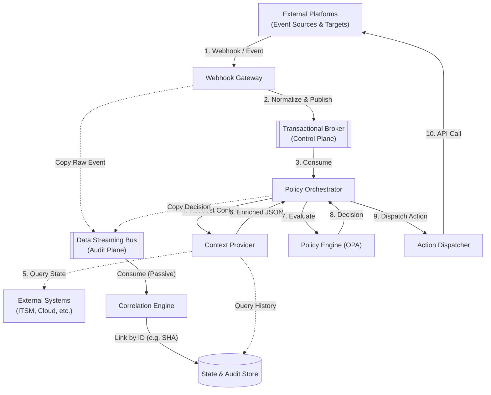
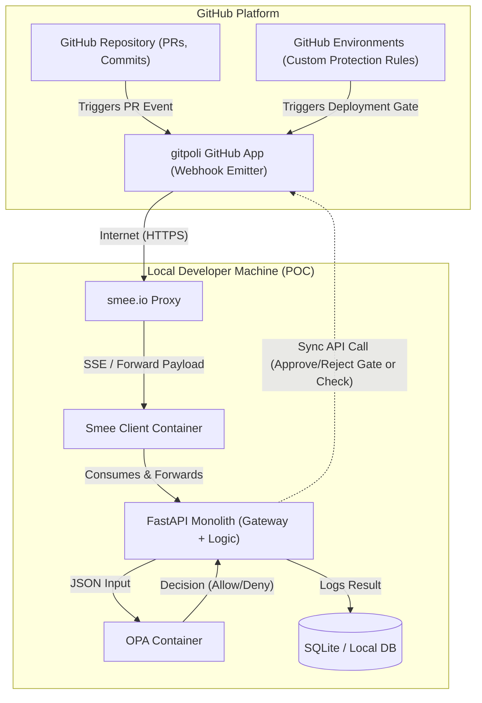
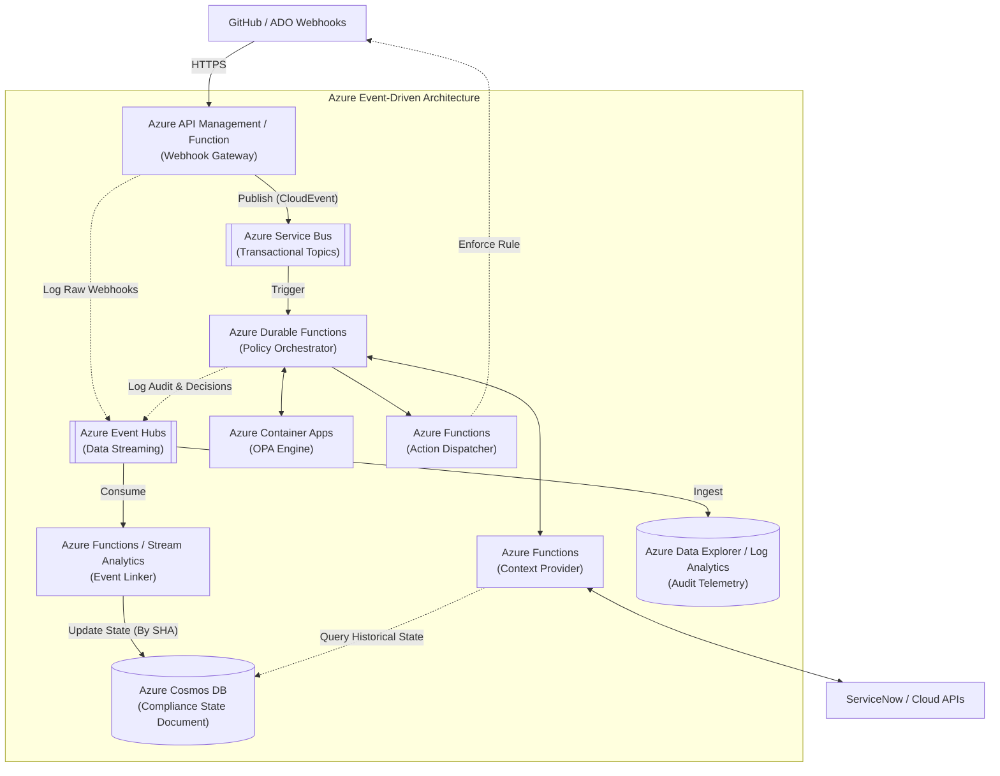
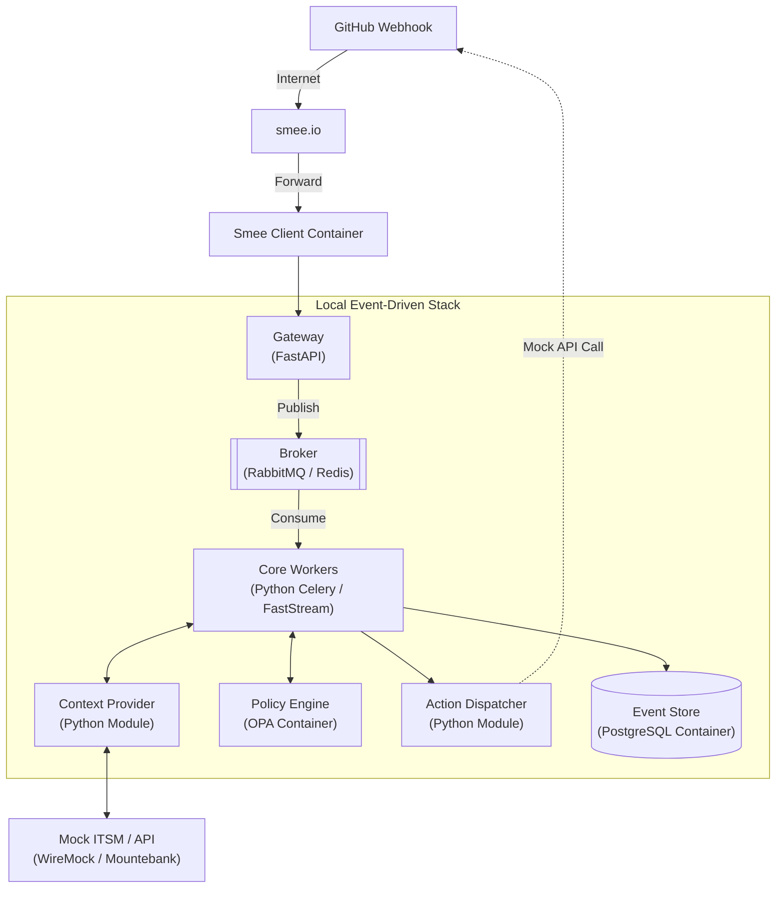

# ADR: Event-Driven Policy as Code Architecture for gitpoli

## Status
Proposed

## Context
The `gitpoli` platform implements the Policy as Code principle for managing deployment policies, pull request validations, and release gates. The primary goal is to decouple policy logic from application code, enabling versioning, auditability, and automated validation.

Currently, the codebase and proof of concept (POC) reflect a synchronous, monolithic approach. Events are received, passed directly to the Open Policy Agent (OPA), and logged in a single linear flow. While functional for a simple GitHub demo, this current state does not scale for advanced, enterprise-grade use cases:
* **Multi-Platform Support:** Receiving events from diverse platforms (GitHub, Azure DevOps, GitLab, etc.) requires a standardized ingestion layer.
* **Complex Policies & Release Gates:** Evaluating rules that depend on external state, such as verifying ITSM ticket approvals (e.g., Jira, ServiceNow) or checking infrastructure configuration before deploying to production.
* **Asynchronous Execution:** Heavy evaluations and external API calls must not block upstream webhooks or cause timeouts on the platform side.
* **Event Correlation:** Auditing and compliance require linking multiple distinct events over time (e.g., tying a specific PR approval to a deployment artifact and its compliance status).

## Decision
We will transition from the current synchronous POC to an **event-driven, highly decoupled architecture based on Serverless/PaaS services**. This design separates the transactional plane (rule execution) from the audit plane (telemetry streaming and correlation).

---

## 1. Architectural Components (Target State / To-Be)

To achieve a truly decoupled and extensible system, the architecture is divided into the following logical components.

### 1.1. Webhook Gateway
* **What it is:** The single public entry point for all external platforms emitting events.
* **Why it is necessary:** Webhook emitters (like GitHub or ADO) require fast responses (usually under 10 seconds). If the system processes the policy synchronously and takes too long, the emitter drops the connection and assumes a failure.
* **Responsibilities:** Receives the webhook, validates cryptographic signatures, normalizes the disparate payload into an internal standard (like *CloudEvents*), immediately publishes it to the Event Bus, and returns a `200 OK` HTTP code to the emitter to release the connection.

### 1.2. Transactional Message Broker (Control Plane)
* **What it is:** An asynchronous messaging queue oriented towards transactions (equivalent to Azure Service Bus, AWS SQS, or RabbitMQ).
* **Why it is necessary:** To ensure no evaluation event is lost. If the policy engine fails temporarily, the broker queues the message and allows automatic retries or sends it to a Dead Letter Queue (DLQ).
* **Responsibilities:** Decouples fast ingestion from heavy evaluation, distributing evaluation tasks to the orchestrator in an orderly and reliable manner.

### 1.3. Data Streaming Bus (Audit & Telemetry Plane)
* **What it is:** A massive data stream ingestion engine (equivalent to Azure Event Hubs or AWS Kinesis Firehose).
* **Why it is necessary:** Saving structured logs for every webhook received and every decision made generates a massive volume of writes. Doing this in the main transactional flow slows down the system.
* **Responsibilities:** Passively ingests copies of original events and final decisions to dump them at high speed into the analytical storage system.

### 1.4. Policy Orchestrator
* **What it is:** The coordinating "brain" of the workflow, ideally implemented using stateful workflows (e.g., Azure Durable Functions).
* **Why it is necessary:** OPA is a stateless engine; it doesn't know how to fetch information or apply decisions. A component must coordinate the data journey.
* **Responsibilities:** Consumes normalized events from the Transactional Broker. Identifies which policy applies, requests necessary extra data from the *Context Provider*, sends the full package to OPA, and delegates the enforcement to the *Action Dispatcher*.

### 1.5. Context Provider (Context Enricher)
* **What it is:** A service dedicated exclusively to fetching external data.
* **Why it is necessary:** Release Gate policies often dictate: "Do not deploy if there is no approved ticket in Jira". Since OPA does not connect to Jira, this component assumes that role.
* **Responsibilities:** Receives requests from the Orchestrator, queries external APIs (ITSM, Cloud, Databases), and returns a consolidated ("enriched") JSON containing all the necessary state of the world so the policy can be evaluated blindly.

### 1.6. Policy Engine (OPA)
* **What it is:** The purely logical and mathematical execution engine based on Open Policy Agent and Rego.
* **Why it is necessary:** It is the core of the *Policy as Code* concept. It isolates the compliance policy source code from the platform's integration logic.
* **Responsibilities:** Validates the enriched JSON against defined schemas, executes Rego policies, and returns a strict verdict (`allow`, `deny`, or a list of `violations`).

### 1.7. Action Dispatcher
* **What it is:** The outbound enforcement component.
* **Why it is necessary:** To isolate OPA and the Orchestrator from the specifics of the target platform APIs.
* **Responsibilities:** Translates the final decision into the specific API call required (e.g., making a POST request to the GitHub API to fail a Check Run, or calling the Azure DevOps API to reject a deployment gate).

### 1.8. Event Store & Correlation Engine
* **What it is:** An analytical and document database ecosystem (e.g., Cosmos DB + Log Analytics / Data Explorer).
* **Why it is necessary:** For security auditing and resolving rules that span across time (e.g., "Does this deployment have a previously approved associated PR?").
* **Responsibilities:** Passively listens to the Data Streaming Bus. Uses unified identifiers (like the *Commit SHA* or *Trace ID*) to build a single document representing the entire lifecycle of a code change, from commit to production.

---

## 2. Architecture Diagrams

### 2.1. Conceptual Target Architecture (To-Be)

This diagram shows the technology-agnostic logical flow, highlighting the separation between transactional processing and the telemetry/correlation plane.

### 2.2. Current Architecture (As-Is / POC)

The current implementation synchronously couples ingestion, evaluation, and enforcement into a single monolith. This diagram illustrates the detailed integration with GitHub using a GitHub App and Custom Protection Rules routed through Smee.

### 2.3. Enterprise Implementation in Azure (To-Be Serverless)

Mapping the conceptual architecture to native Microsoft Azure Serverless and PaaS services, removing the need to manage Kubernetes (AKS) clusters and optimizing for cost and scalability.

### 2.4. Local Development & Integration Testing (Docker Compose)

To maintain an agile local development cycle, the cloud architecture is emulated using lightweight containers and mock implementations.

---

## Consequences

* **Pros:**
  * **Technology Agnostic:** Core logic is insulated from specific tools; components can be swapped with minimal impact.
  * **Highly Scalable:** Asynchronous processing prevents bottlenecks during high loads or slow external API responses.
  * **Extensible Context:** Easily handles complex policies like Release Gates by plugging new data sources into the Context Provider.
  * **Robust Auditing:** The Event Store and Correlation Engine provide a single source of truth for compliance reporting and historical event lineage.
  * **Cost-Effective (Azure):** Utilizing a fully Serverless stack (Functions, Container Apps) scales to zero and eliminates the overhead of managing underlying infrastructure like Kubernetes.
* **Cons:**
  * **Increased Architecture Complexity:** Requires deploying and maintaining multiple components (Broker, Streaming Hub, Orchestrator) compared to a simple synchronous API.
  * **Tracing Difficulty:** Troubleshooting requires robust distributed tracing (e.g., correlation IDs) as requests flow asynchronously through queues.
  * **Eventual Consistency:** External platform updates (like GitHub checks) are not strictly synchronous with the initial webhook trigger.
