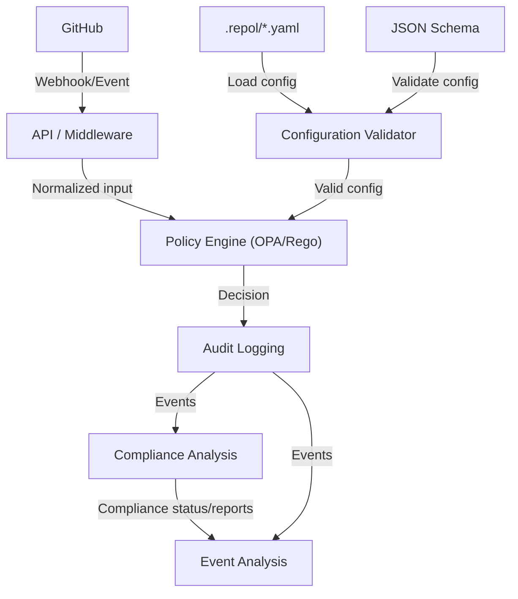

## Full Architecture Diagram

```mermaid
flowchart TD
   GH["GitHub"]
   API["API / Integration Middleware"]
   Validator["Configuration Validator"]
   Engine["Policy Engine (OPA/Rego)"]
   Audit["Event and Audit Logging"]
   Compliance["Compliance Analysis"]
   Analysis["Event Analysis and Processing"]
   Config[".repol/*.yaml"]
   Schema["JSON Schema"]

   GH -- "Webhook/Event" --> API
   Config -- "Load config" --> Validator
   Schema -- "Validate config" --> Validator
   API -- "Normalized input" --> Engine
   Validator -- "Valid config" --> Engine
   Engine -- "Decision" --> Audit
   Audit -- "Events" --> Compliance
   Audit -- "Events" --> Analysis
   Compliance -- "Compliance status/reports" --> Analysis

   subgraph Storage
      Audit
   end

   subgraph Policy
      Validator
      Engine
   end

   subgraph Analysis
      Compliance
      Analysis
   end
```

# ADR: Policy as Code Architecture for gitpoli

## Status
Accepted

## Context

The gitpoli platform implements the Policy as Code principle for managing deployment and pull request policies in GitHub. The goal is to decouple policy logic from application code, enabling versioning, auditability, and automated validation of policies.

### Principles to Implement

- **Declarative policies:** Policies are defined as code, versioned, and auditable.
- **Strict validation:** All configuration is validated against schemas before evaluation.
- **Extensibility:** The architecture allows new policy types, backends, and event sources to be added easily.
- **Observability:** Event logging and analysis for audit and continuous improvement.
- **Decoupling:** Separation of policy logic, event integration, and audit storage.

### Why Rego?

- **Open standard:** Rego (OPA) is widely adopted for Policy as Code, with a declarative syntax and support for multiple scenarios.
- **Flexibility:** Enables expression of complex rules and reuse of common logic.
- **Portability:** Policies can be evaluated in different environments (local, cloud, CI/CD).
- **Security:** Facilitates review and audit of rules.

## Decision


### Architectural Components

1. **API / Integration Middleware**
   - Receives external events (GitHub webhooks, REST, etc.).
   - Normalizes and routes events to internal components.
   - Example: FastAPI server, webhook adapters.

2. **Policy Engine**
   - Evaluates policies written in Rego using OPA.
   - Receives validated input and produces decisions (`allow`, `violations`).
   - Enables easy addition of new policies.

3. **Configuration Validator**
   - Validates configuration files (`.repol/*.yaml`) against JSON Schemas.
   - Ensures only valid data reaches the policy engine.

4. **Event and Audit Logging**
   - Stores events, decisions, and evaluation results.
   - Enables traceability and historical record-keeping.
   - Example: SQLite, CosmosDB, custom adapters.

5. **Compliance Analysis**
   - Correlates and analyzes stored events to evaluate compliance with policies over time.
   - Supports compliance state tracking, historical queries, and generation of compliance reports or alerts.
   - Enables advanced compliance decision-making based on event history and policy requirements.

6. **Event Analysis and Processing**
   - Enables advanced analysis of historical events for reporting, alerting, and recommendations beyond compliance.


### Workflow

1. Receive external event (e.g., GitHub webhook).
2. Load and validate policy configuration.
3. Normalize event and build input for OPA.
4. Evaluate policies in Rego.
5. Process result and log audit.
6. Correlate and analyze events in the Compliance Analysis component to determine compliance status and generate reports or alerts.
7. Optionally: Further analyze events for reporting, alerting, and recommendations.

## Consequences

- **Pros:**
  - Versioned, auditable, and easily modifiable policies.
  - Modular and extensible architecture.
  - Robust validation and decoupling of components.
  - Facilitates integration with new event sources and backends.

- **Cons:**
  - Requires keeping schemas, policies, and input normalization in sync.
  - Increased initial complexity, offset by flexibility and robustness.


## Architecture Diagram


  OPA -- "Decision" --> Server
  Server -- "GitHub API" --> GH
```

## Related Decisions
- Use of OPA/Rego for policy logic
- Hexagonal architecture for backend
- Explicit handler registry for event dispatch

---

*Date: 2026-03-18*
*Author: GitHub Copilot*
